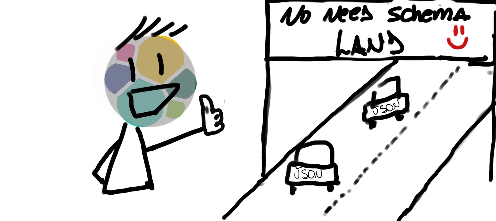
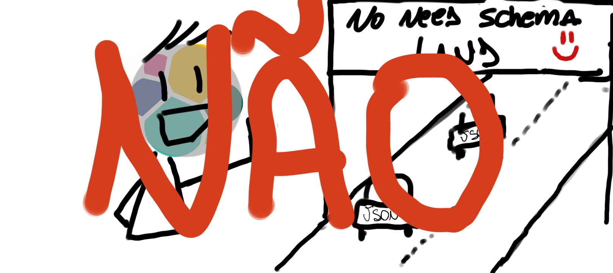
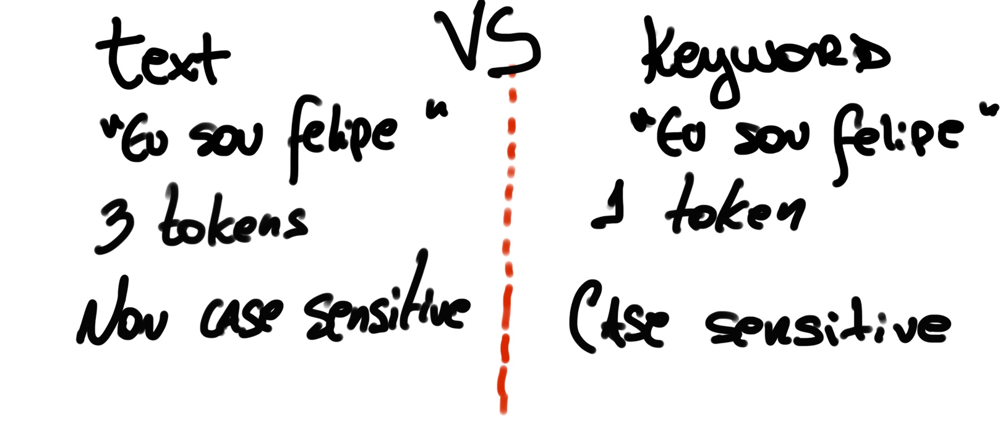

| [Home](https://techlipe.github.io/Guia-Completo-Elastic-Stack) | [Documentação](https://techlipe.github.io/Guia-Completo-Elastic-Stack/guia-completo) | [Videos](https://techlipe.github.io/Guia-Completo-Elastic-Stack/rasgando-o-bit-com-elastic) | 


# Workshop Elastic -  O Caminho para se tornar Elastic Certified (Dia 3) - Elasticsearch
* **Criado por:** Felipe Queiroz <br>
* **Última atualização:** 16.12.2020


# Utilidades!

[Video do dia](https://www.youtube.com/watch?v=Ynn9YEDPeks)

[Download da Planilha de apoio](https://github.com/techlipe/Guia-Completo-Elastic-Stack/raw/master/Cronograma%20de%20Certifica%C3%A7%C3%A3o%20-%20Certified%20Engineer.xlsx)

# Conteudo

## Elasticsearch - E.D/Text vs Keyword/Mapping/Dynamic/Templates

**Como funciona o padrão de estrutura de dados do Elasticsearch?**

Por padrão, o usuário normalmente não deve se preocupar em criar uma estrutura de dados para suportar o seu indice. Isso se dá pelo fato de que o Elasticsearch trabalha como ferramenta _Schema-Free_.



Isso ocorre por alguns fatores, dentre eles o fato de que o Elasticsearch utiliza de mapeamento dinâmico para realizar os mapeamentos dos indices de maneira automática. Vamos daqui a pouco como ele se comporta.

O ponto é, deixar o Elasticsearch mapear automaticamente é uma boa prática pra produção?

A resposta é **não**.



Vamos entender analisando um ponto interessante, como o Elasticsearch lida com indexação de campos do tipo "string/texto" por padrão?


**Text e Keyword, como funcionam ambos:**


1) Vamos indexar alguns documentos sem definir um mapeamento previo e ver como nosso índice se comporta.

```
PUT filmes/_doc/1
{
  "nome_do_filme": "Toy Story",
  "ano_lancamento": 1995,
  "idioma_original": "ingles",
  "breve_descricao" : "Toy Story (bra: Toy Story – Um Mundo de Aventuras[3][4]; prt: Toy Story – Os Rivais[5][6]) é um filme de animação, aventura e comédia americano lançado em 1995. É conhecido por ser o primeiro filme da história do cinema a ter sido compilado inteiramente por ferramentas de computação gráfica. [...]"
}

PUT filmes/_doc/2
{
  "nome_do_filme": "Toy Story 2",
  "ano_lancamento": 1999,
  "idioma_original": "ingles",
  "breve_descricao" : "Toy Story 2 (Toy Story 2 – Em Busca de Woody (título em Portugal) ) é um filme americano de animação, aventura e comédia de 1999, dirigido por John Lasseter e produzido pela Pixar Animation Studios em parceria com a Walt Disney Pictures. É a sequência de Toy Story, de 1995, e o segundo filme da franquia homônima. [...]"
}

PUT filmes/_doc/3
{
  "nome_do_filme": "Jurassic Park",
  "ano_lancamento": 1993,
  "idioma_original": "ingles",
  "breve_descricao" : "Jurassic Park (no Brasil, Jurassic Park - Parque dos Dinossauros[2][3]; em Portugal, Parque Jurássico[4][5]) é um filme de aventura e ficção científica estadunidense de 1993, dirigido por Steven Spielberg e baseado no livro homônimo escrito por Michael Crichton. Produzido pela Amblin Entertainment e distribuído pela Universal Pictures, é estrelado por Sam Neill, Laura Dern, Jeff Goldblum, Richard Attenborough, Ariana Richards, Joseph Mazzello, Samuel L. Jackson e Bob Peck. [...]"
}

PUT filmes/_doc/4
{
  "nome_do_filme": "Cidade de Deus",
  "ano_lancamento": 2002,
  "idioma_original": "ingles",
  "breve_descricao" : "Cidade de Deus é um filme de ação brasileiro de 2002 produzido por O2 Filmes, Globo Filmes e Videofilmes e distribuído por Lumière Brasil. É uma adaptação roteirizada por Bráulio Mantovani a partir do livro de mesmo nome escrito por Paulo Lins. Foi dirigido por Fernando Meirelles, codirigido por Kátia Lund e estrelado por Alexandre Rodrigues, Leandro Firmino, Jonathan Haagensen, Matheus Nachtergaele, Douglas Silva e Seu Jorge.[...]"
}

```

2. Obtendo o mapeamento auto-gerado

```
GET filmes/_mapping
```

3. Testando as buscas

```
GET filmes/_search
{
  "query": {
    "match": {
      "nome_do_filme": "Toy"
    }
  }
}

GET filmes/_search
{
  "query": {
    "match": {
      "nome_do_filme": "Deus"
    }
  }
}

GET filmes/_search
{
  "query": {
    "match": {
      "nome_do_filme.keyword": "Cidade de Deus"
    }
  }
}

```

4. Teste de analise - Analisador padrão vs um Analisador especializado no seu texto

```
GET filmes/_analyze
{
  "field": "nome_do_filme",
  "text": ["Toy Story"]
}

GET filmes/_analyze
{
  "field": "nome_do_filme.keyword",
  "text": ["Toy Story"]
}

GET filmes/_analyze
{
  "field": "breve_descricao",
  "text": ["Cidade de Deus é um filme de ação brasileiro de 2002 produzido por O2 Filmes, Globo Filmes e Videofilmes e distribuído por Lumière Brasil. É uma adaptação roteirizada por Bráulio Mantovani a partir do livro de mesmo nome escrito por Paulo Lins. Foi dirigido por Fernando Meirelles, codirigido por Kátia Lund e estrelado por Alexandre Rodrigues, Leandro Firmino, Jonathan Haagensen, Matheus Nachtergaele, Douglas Silva e Seu Jorge.[...]"]
}


GET _analyze
{
  "analyzer": "portuguese",
  "text": ["Cidade de Deus é um filme de ação brasileiro de 2002 produzido por O2 Filmes, Globo Filmes e Videofilmes e distribuído por Lumière Brasil. É uma adaptação roteirizada por Bráulio Mantovani a partir do livro de mesmo nome escrito por Paulo Lins. Foi dirigido por Fernando Meirelles, codirigido por Kátia Lund e estrelado por Alexandre Rodrigues, Leandro Firmino, Jonathan Haagensen, Matheus Nachtergaele, Douglas Silva e Seu Jorge.[...]"]
}
```


**Entendendo como funcionam os mapeamentos:**

1. Deletando o indice e criando o mapeamento previo

```
DELETE filmes

PUT filmes
{
  "mappings": {
    "properties": {
      "nome_do_filme" : {
        "type": "text"
      },
      "ano_lancamento" : {
        "type": "integer"
      },
      "idioma_original" : {
        "type": "keyword"
      },
      "breve_descricao" : {
        "type": "text", 
        "analyzer": "portuguese"
      }
    }
  }
}
```

2. Indexar os dados novamentes e realizar o teste de mapeamento

```
Consultar comandos executados acima
```

3. Analisar novamente o campo descrição

```
GET filmes/_analyze
{
  "field": "breve_descricao",
  "text": ["Cidade de Deus é um filme de ação brasileiro de 2002 produzido por O2 Filmes, Globo Filmes e Videofilmes e distribuído por Lumière Brasil. É uma adaptação roteirizada por Bráulio Mantovani a partir do livro de mesmo nome escrito por Paulo Lins. Foi dirigido por Fernando Meirelles, codirigido por Kátia Lund e estrelado por Alexandre Rodrigues, Leandro Firmino, Jonathan Haagensen, Matheus Nachtergaele, Douglas Silva e Seu Jorge.[...]"]
}
```

**Introdução a Templates**

1. Criando nosso primeiro template

```
PUT _template/filmes
{
  "index_patterns": ["filmes*"],
  "settings": {
    "number_of_replicas": 0,
    "number_of_shards": 1
  }, 
  "mappings": {
    "properties": {
      "nome_do_filme" : {
        "type": "text"
      },
      "ano_lancamento" : {
        "type": "integer"
      },
      "idioma_original" : {
        "type": "keyword"
      },
      "breve_descricao" : {
        "type": "text", 
        "analyzer": "portuguese"
      }
    }
  }
}

```

2. Teste de indexação e respeito do indice

```
PUT filmes-1/_doc/1
{
  "nome_do_filme": "Toy Story",
  "ano_lancamento": 1995,
  "idioma_original": "ingles",
  "breve_descricao" : "Toy Story (bra: Toy Story – Um Mundo de Aventuras[3][4]; prt: Toy Story – Os Rivais[5][6]) é um filme de animação, aventura e comédia americano lançado em 1995. É conhecido por ser o primeiro filme da história do cinema a ter sido compilado inteiramente por ferramentas de computação gráfica. [...]"
}

GET filmes-1/_mapping
```

**Implementando Dynamic Template para strings genericas no template de filmes**

```
PUT _template/filmes
{
  "index_patterns": ["filmes*"],
  "settings": {
    "number_of_replicas": 0,
    "number_of_shards": 1
  }, 
  "mappings": {
    "dynamic_templates": [
      {
        "inteiros": {
          "path_match": "int_*",
          "mapping": {
            "type": "integer"
          }
        }
      },
      {
        "texto": {
          "match_mapping_type": "string",
          "mapping": {
            "type": "text",
            "analyzer" : "portuguese"
          }
        }
      }
    ],
    "properties": {
      "nome_do_filme" : {
        "type": "text"
      },
      "idioma_original" : {
        "type": "keyword"
      },
      "breve_descricao" : {
        "type": "text", 
        "analyzer": "portuguese"
      }
    }
  }
}
```

2. Deletando o indice e inserindo um novo documento no indice filmes-1

```
DELETE filmes-1

PUT filmes-1/_doc/1
{
  "nome_do_filme": "Toy Story",
  "ano_lancamento": 1995,
  "idioma_original": "ingles",
  "breve_descricao" : "Toy Story (bra: Toy Story – Um Mundo de Aventuras[3][4]; prt: Toy Story – Os Rivais[5][6]) é um filme de animação, aventura e comédia americano lançado em 1995. É conhecido por ser o primeiro filme da história do cinema a ter sido compilado inteiramente por ferramentas de computação gráfica. [...]",
  "campo_teste_texto" : "Esse é um texto para teste do analyzer portugues",
  "int_teste" : "200"
}
```

3. Teste do novo mapeamento e do Analyze

```
GET filmes-1/_mapping

GET filmes-1/_analyze
{
  "text": ["Esse é um texto para teste do analyzer portugues"],
  "field": "campo_teste_texto"
}
```

